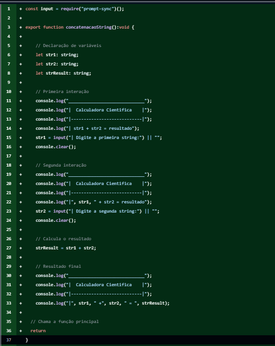
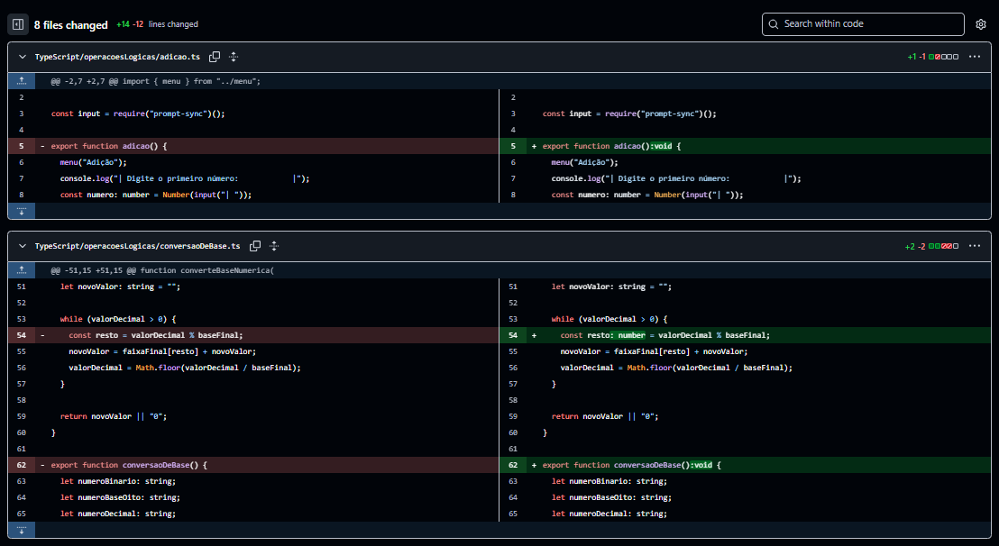
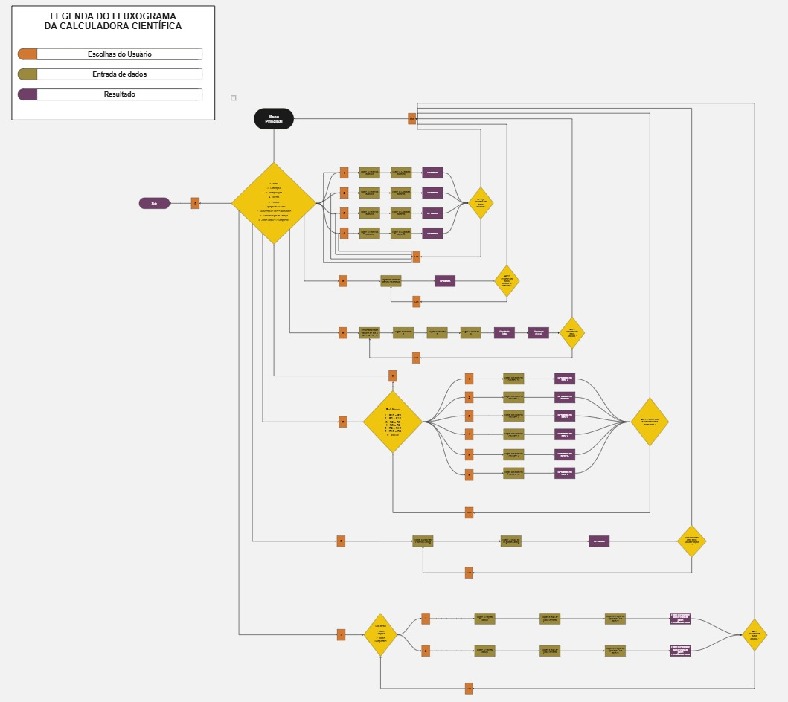

# 🚀 API 1º Semestre - 01/2024

### 🔗 🎓 Parceiro Acadêmico

FATEC São José dos Campos - Prof. Jessen Vidal

---

## 📌 Resumo do Projeto

Desenvolvimento de uma **Calculadora Científica** capaz de realizar operações básicas e complexas, atendendo necessidades contábeis do dia a dia.

A solução contempla operações de:

- adição
- subtração
- multiplicação
- divisão
- fatorial
- equação de 2º grau
- conversão de bases numéricas
- concatenação de strings
- juros simples e compostos

O projeto foi implementado em duas frentes tecnológicas:

- **VisualG (Portugol):** para consolidar a lógica algorítmica;
- **TypeScript:** voltado a boas práticas de desenvolvimento com tipagem estática.

---

## ⚠️ Problema

Havia a necessidade de desenvolver uma ferramenta simples e funcional para realização de **cálculos matemáticos e financeiros**, permitindo maior praticidade no uso e precisão nos resultados.

---

## 💡 Solução

Foi desenvolvida uma **calculadora científica interativa**, executada via terminal, com suporte a diferentes operações matemáticas, lógicas e financeiras.

A aplicação foi construída inicialmente em **VisualG**, como base para aprendizado da lógica de programação, e posteriormente adaptada para **TypeScript**, trazendo maior organização, legibilidade e segurança por meio da tipagem estática.

---

## 🔗 Repositório do Projeto

📎 [Acesse o repositório no GitHub](https://github.com/SQLutions-FATEC/API-1-Semestre)

---

## 🛠 Tecnologias Adotadas

| Tecnologia | Descrição |
|:---|:---|
| **VisualG 3.0** | Ambiente de desenvolvimento em Portugol utilizado para a construção inicial da lógica da calculadora, permitindo o aprendizado de algoritmos e estruturas de controle sem a complexidade de uma linguagem de produção. |
| **TypeScript** | Linguagem com tipagem estática utilizada para a versão principal do projeto. Escolhida para introduzir boas práticas de desenvolvimento, como tipagem explícita de variáveis e retornos de funções. |
| **Node.js** | Runtime utilizado para executar a calculadora TypeScript via terminal, com o auxílio da biblioteca `prompt-sync` para captura de entrada do usuário. |
| **Git & GitHub** | Controle de versionamento e colaboração em equipe. O repositório utilizou commits semânticos (`feat`, `fix`, `refactor`) para rastreabilidade das entregas. |

---

## 🧩 Metodologia

O projeto adotou princípios da **metodologia ágil Scrum**, adaptados ao contexto acadêmico.

As principais práticas utilizadas foram:

- **Backlog do Produto:** organizado e priorizado via GitHub Projects, onde cada operação da calculadora foi mapeada como uma tarefa;
- **Divisão por subgrupos:** as operações foram distribuídas entre os membros da equipe, permitindo desenvolvimento paralelo;
- **Validação e Testes:** a equipe realizou testes de validação para garantir a precisão dos cálculos antes de cada entrega;
- **Reuniões de acompanhamento:** encontros regulares e formulários foram utilizados para compartilhar o andamento e alinhar prioridades.

---

## 👨‍💻 Contribuições Individuais

Atuei como **Developer**, contribuindo diretamente no código **TypeScript** da calculadora em duas frentes principais:

---

<b>🔤 Desenvolvimento da funcionalidade de Concatenação de Strings</b>

 

Implementei do zero a função `concatenacaoString()`, responsável por receber duas strings do usuário via terminal, processá-las e exibir o resultado concatenado.

Essa funcionalidade envolveu:

- estruturação da interface de interação com o usuário no terminal (menus e prompts);
- captura e validação de entrada utilizando a biblioteca `prompt-sync`;
- lógica de concatenação e exibição formatada do resultado;
- integração da função ao menu principal da calculadora.

### 🛠️ Implementação do Código

A implementação a seguir detalha a arquitetura da função concatenacaoString(). O foco desta entrega foi garantir a integridade dos dados através de tipos estritos e consolidar uma lógica de interação robusta, servindo como base para a expansão do sistema

<b>Clique aqui para ver a imagem

  

*Visualização da estrutura da função com comentários explicativos, menus de terminal e lógica de concatenação.*

<b>🛠 Refatoração de tipagem em 8 módulos do projeto</b>

 

Realizei uma refatoração abrangente focada em **boas práticas de tipagem TypeScript**, adicionando tipos explícitos de retorno (`:void`) e tipagem de variáveis em **8 arquivos** de operações lógicas:

- `adicao.ts` — Adição
- `subtracao.ts` — Subtração
- `multiplicacao.ts` — Multiplicação
- `divisao.ts` — Divisão
- `fatorial.ts` — Fatorial
- `funcaoSegundoGrau.ts` — Equação de 2º Grau
- `juros.ts` — Juros Simples e Compostos
- `conversaoDeBase.ts` — Conversão de Bases Numéricas

### 🛠️ Implementação do Código
Essa refatoração garantiu maior **segurança de tipos** no projeto, reduzindo a possibilidade de erros em tempo de execução e melhorando a legibilidade do código para toda a equipe.

<b>Clique aqui para ver a imagem

  
  *Visualização do diff do Git, destacando a padronização e o aumento da integridade do código através da tipagem estática aplicada.*

 

<b>📊 Elaboração do fluxograma da calculadora científica</b>

Também fui responsável pela **modelagem visual do fluxo de funcionamento da calculadora**, por meio da elaboração de um **fluxograma detalhado** da aplicação.

Esse fluxograma foi criado com o objetivo de:

- representar visualmente a lógica de navegação do sistema;
- organizar o fluxo entre **menu principal**, **submenus**, **entrada de dados** e **resultados**;
- facilitar a compreensão da estrutura do programa pela equipe;
- apoiar o desenvolvimento e a validação das funcionalidades implementadas.

### 🛠️ Implementação do Código
A construção desse material contribuiu para melhorar a **clareza da lógica do sistema**, além de servir como apoio no entendimento do comportamento geral da aplicação.

<b>Clique aqui para ver a imagem

  

## 📚 Aprendizados Efetivos

Este projeto representou meu primeiro contato mais estruturado com o desenvolvimento em equipe e com a construção de uma aplicação voltada à resolução de problemas reais por meio da programação.

Ao longo do semestre, desenvolvi principalmente minha base em **lógica de programação**, compreendendo melhor como transformar uma necessidade funcional em uma solução implementável. A participação no desenvolvimento da calculadora me ajudou a evoluir na construção de fluxos lógicos, no entendimento de entrada e saída de dados e na organização do raciocínio para implementação de funcionalidades.

Também tive um avanço importante no uso de **TypeScript**, principalmente ao compreender melhor o papel da **tipagem explícita** na legibilidade, segurança e manutenção do código. A refatoração que realizei em diferentes módulos do projeto reforçou minha percepção de que escrever código não é apenas “fazer funcionar”, mas também garantir clareza e consistência para quem mantém o sistema depois.

Outro aprendizado importante foi perceber o valor da **documentação visual e estrutural**, especialmente com a elaboração do fluxograma da aplicação, que me ajudou a enxergar melhor a lógica geral do sistema e a relação entre menus, entradas e resultados.

Além da parte técnica, esse projeto também fortaleceu minha vivência com **trabalho em equipe**, **organização de tarefas**, **versionamento com Git** e **dinâmica de desenvolvimento colaborativo**.

## 🧠 Hard Skills

### 🧠 Hard Skills

| Tecnologia/Metodologia | Nota | Classificação | O que me falta |
| :--- | :--- | :--- | :--- |
| **Metodologia Ágil Scrum** | ★★★☆☆ | Entendi | Aprofundar em papéis específicos (PO/Master) e cerimónias de refinamento. |
| **VisualG** | ★★★☆☆ | Entendi | Explorar algoritmos de maior complexidade e estruturas de dados avançadas. |
| **TypeScript** | ★★★☆☆ | Entendi | Dominar conceitos de Generics e integração profunda com frameworks externos. |
| **Git** | ★★★★★ | Sei fazer com autonomia | Praticar fluxos complexos como Rebase, Stash e resolução de conflitos avançados. |
---

## 🤝 Soft Skills

| Soft Skill | Como desenvolvi neste projeto |
|:---|:---|
| **Organização** | Contribuí para manter clareza na estrutura do projeto, tanto no código quanto na compreensão do fluxo da aplicação. |
| **Atenção à Qualidade** | A refatoração de tipagem demonstrou meu cuidado com a legibilidade, padronização e manutenção do código. |
| **Aprendizado Contínuo** | Busquei compreender novas ferramentas e conceitos, especialmente no uso de TypeScript e no raciocínio por trás da estrutura lógica da aplicação. |
| **Trabalho em Equipe** | Atuei em um projeto colaborativo, respeitando a divisão de responsabilidades e contribuindo com entregas que se integravam ao trabalho dos demais membros. |
| **Comunicação Técnica** | A elaboração do fluxograma e a organização das funcionalidades exigiram clareza na forma de representar e explicar o funcionamento da aplicação. |

---

## 🔎 Navegação entre Projetos

- [🚀 1º Semestre: Calculadora Científica](./1-semestre.md)
- [🧠 2º Semestre: Projeto Avaliador de Soft Skill](./2-semestre.md)
- [📊 3º Semestre: Sistema de Ponto e Geração de Relatórios](./3-semestre.md)
- [🛡️ 4º Semestre: Monitoramento e Resposta a Incidentes](./4-semestre.md)
- [📌 5º Semestre: TODO](./5-semestre.md)
- [📌 6º Semestre: TODO](./6-semestre.md)

---

### ✨ Desenvolvido durante a graduação em Banco de Dados

